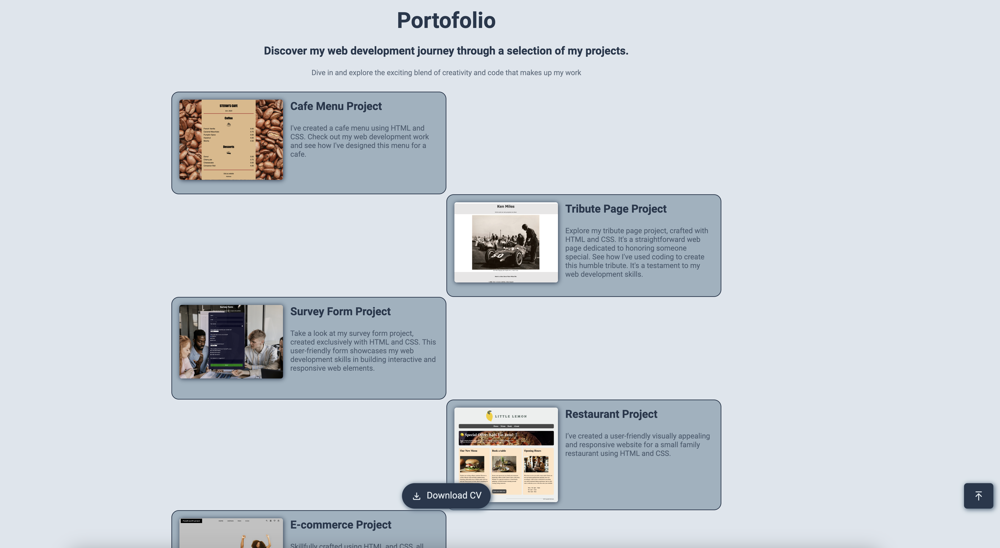
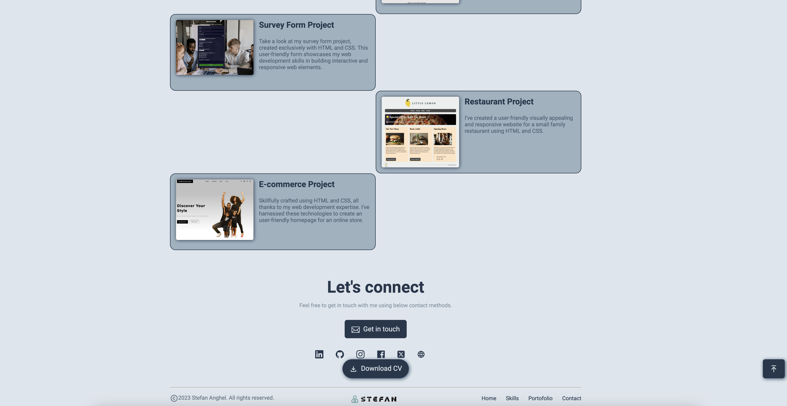
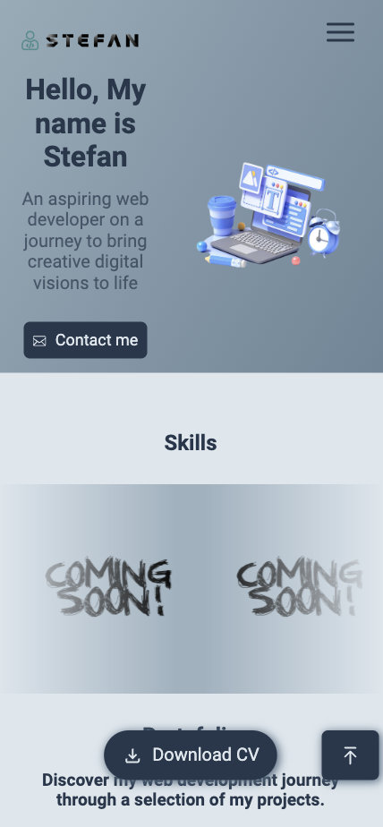
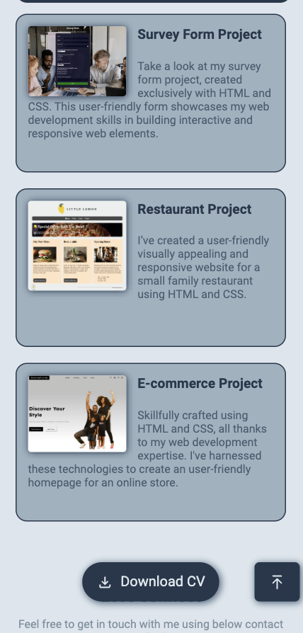
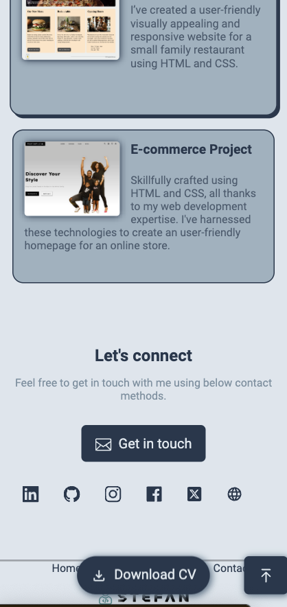

#  Personal website

Personal Website Portfolio: This GitHub repository contains the HTML, CSS and JavaScript code for my personal website, showcasing my projects and skills.

## Table of contents

- [Overview](#overview)
  - [The challenge](#the-challenge)
  - [Screenshot](#screenshot)
  - [Links](#links)
- [My process](#my-process)
  - [Built with](#built-with)
  - [What I learned](#what-i-learned)
  - [Continued development](#continued-development)
- [Author](#author)

## Overview

### The challenge

Users should be able to:

- View the optimal layout for the app depending on their device's screen size
- See hover states for all interactive elements on the page
- Select and submit a number rating
- See the "Thank you" card state after submitting a rating

### Screenshot

### Links

- Live Site URL: 

## My process

### Built with

- Semantic HTML5 markup
- CSS custom properties
- Flexbox
- JavaScript

### What I learned

I've learned how to use 'forEach' loop for arrays to get all the buttons and apllied different states based on user clicks.

I've also learned how to display a popup message after the user presses the Submit button to submit the rating.

I've refreshed my knowledge about the switch statement and some CSS and HTML features.

### Continued development

In the future I will continue expand my JavaScript knowledge by building some cool projects.

## Author

- Website - [Stefan Anghel](https://stefananghel93.github.io/personal-website/)
- Github - [@stefananghel93](https://github.com/stefananghel93)
- LinkedIn - [@stefan-anghel](https://www.linkedin.com/in/stefan-anghel/)

